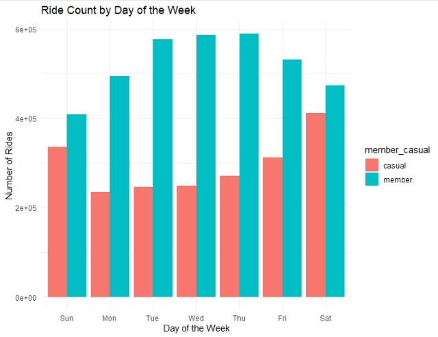
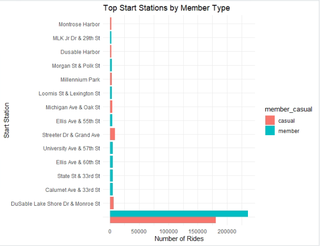

# Data analytics | Capstone - Case Study 1: How does a bike-share navigate speedy success?

Hi there, over the few months, I've been working on the Google Data Analytics Professional Certificate through Coursera.

With 8 courses including, Google team takes me through the Data analytics phases.

At the last course, we have capstone projects which are required as a part of the certificate - junior data analyst skill.

This article would be sharing how I approached and completed the Case Studies which I encapsulated-applied all of the learned| achieved skills from the course, I will perform many real-worlds tasks of a junior data analyst

## Quick links

- [Google Data Analytics Professional Certificate course on Coursera](https://www.coursera.org/professional-certificates/google-data-analytics)
- [My Google Data Analytics Professional Certificate Learning Documentation repository](https://github.com/nguyenthanhjt/google-data-analytics-professional-certificate-course)

## Table of Contents

- [Capstone - Case Study 1: How does a bike-share navigate speedy success?](#capstone---case-study-1-how-does-a-bike-share-navigate-speedy-success)
  - [Table of Contents](#table-of-contents)
  - [Introduction](#introduction)
    - [Scenario](#scenario)
    - [Background](#background)
      - [**Cyclistic Overview**](#cyclistic-overview)
      - [**Company History**](#company-history)
      - [**Marketing Strategy**](#marketing-strategy)
      - [**Objective**](#objective)
  - [Data Analysis Process](#data-analysis-process)
  - [1. ASK](#1-ask)
    - [**Main Objective**](#main-objective)
    - [**Business Tasks**](#business-tasks)
    - [**Deliverables**](#deliverables)
  - [2. PREPARE](#2-prepare)
    - [**\[PREPARE\] Key Tasks**](#prepare-key-tasks)
    - [**Guiding Questions**](#guiding-questions)
    - [Data Organization](#data-organization)
  - [3. PROCESS](#3-process)
    - [**\[PROCESS\] Key Tasks**](#process-key-tasks)
    - [**Steps:**](#steps)
  - [4. ANALYZE](#4-analyze)
    - [**\[ANALYZE\] Key Tasks**](#analyze-key-tasks)
  - [5. SHARE](#5-share)
    - [**\[SHARE\] Key Tasks**](#share-key-tasks)
    - [**Visualizations:**](#visualizations)
  - [6. ACT](#6-act)
    - [**\[ACT\] Key Tasks**](#act-key-tasks)

## Introduction

### Scenario

As a junior data analyst on the marketing team at Cyclistic, a bike-share company in Chicago, I have been tasked with understanding how casual riders and annual members use Cyclistic bikes differently. The director of marketing believes that converting casual riders into annual members is key to the company’s future success. To achieve this, we need to provide data-backed insights and professional visualizations to Cyclistic executives.

### Background

#### **Cyclistic Overview**

Cyclistic is a bike-share program with more than 5,800 bicycles and 600 docking stations in Chicago. It offers a variety of bikes, including reclining bikes, hand tricycles, and cargo bikes, making it inclusive for people with disabilities. While most riders use traditional bikes, 8% use assistive options. About 30% of users ride for commuting, while the rest ride for leisure.

#### **Company History**

Cyclistic launched in 2016 and has grown to a fleet of 5,824 bicycles geotracked and locked into a network of 692 stations across Chicago. Riders can unlock bikes from one station and return them to any other in the system.

#### **Marketing Strategy**

Cyclistic has relied on building general awareness with flexible pricing plans: single-ride passes, full-day passes, and annual memberships. Finance analysts have concluded that annual members are more profitable than casual riders. Therefore, the goal is to convert casual riders into annual members.

#### **Objective**

Moreno, the director of marketing, has set a clear goal: Design marketing strategies to convert casual riders into annual members. The marketing analyst team needs to analyze Cyclistic’s historical bike trip data to identify trends and make data-driven recommendations.

## Data Analysis Process

This case study follows the 6 steps of the Data Analysis process: ASK, PREPARE, PROCESS, ANALYZE, SHARE, and ACT. R and RStudio are utilized for data analysis due to the large dataset size.

## 1. ASK

### **Main Objective**

To understand how casual riders and annual members use Cyclistic bikes differently.

### **Business Tasks**

- Identify the business task: What attracts casual riders to become annual members?
- Consider key stakeholders:
  - Director of Marketing, Moreno: Responsible for developing campaigns and initiatives.
  - Executive Team: Will approve the recommended marketing program.
  - Analytics Team: Collects, analyzes, and reports data for the marketing strategy.

### **Deliverables**

- A clear statement of the business task: Identify key factors that attract riders to become annual members.
- Problem Statement: How do annual members and casual riders use Cyclistic bikes differently?
- Insights for Business Decisions: Identify differences to define and design a marketing campaign to attract more members and increase profits.

## 2. PREPARE

### **[PREPARE] Key Tasks**

- Download and store data appropriately.
- Identify how it’s organized.
- Sort and filter the data.
- Determine the credibility of the data.

### **Guiding Questions**

- **Credibility and Bias:** The data is reliable, original, comprehensive, current, and cited, provided by Lyft Bikes and Scooters, LLC.
- **Licensing, Privacy, Security, Accessibility:** The data is open and maintained by Motivate International Inc., following the Data License Agreement on [Divvy Bikes](https://divvybikes.com/data-license-agreement).
- **Data Integrity:** The data was examined and verified for consistency in columns and data types.
- **Relevance:** The data helps analyze both annual members and casual riders, providing insights into their characteristics and bike usage.

### Data Organization

**Data Source**: Cyclistic’s historical data from 2013 to 2024, available [here](https://divvy-tripdata.s3.amazonaws.com/index.html).

The data consists of CSV files organized by quarters from 2013 to 2019 and by month from 2020 to 2024. The analysis focuses on data from 2023, with 12 files named `YYYYMM-divvy-tripdata.csv`.

**Columns:**

- `ride_id`: Ride identifier
- `rideable_type`: Type of bike
- `started_at`: Start time
- `ended_at`: End time
- `start_station_id`, `start_station_name`, `start_lat`, `start_lng`: Start station details
- `end_station_id`, `end_station_name`, `end_lat`, `end_lng`: End station details
- `member_casual`: Member type (casual or annual)

## 3. PROCESS

### **[PROCESS] Key Tasks**

- Check the data for errors.
- Choose tools.
- Transform the data for effective analysis.
- Document the cleaning process.

### **Steps:**

1. **Load Required Packages:**

    ```r
    install.packages('tidyverse')
    install.packages('janitor')
    install.packages('lubridate')
    library(tidyverse)
    library(janitor)
    library(lubridate)
    ```

2. **Collect Data:**

    ```r
    getwd() # Get working directory
    setwd("./input-data/") # Set working directory

    m01 <- read.csv("./input-data/202301-divvy-tripdata.csv")
    m02 <- read.csv("./input-data/202302-divvy-tripdata.csv")
    m03 <- read.csv("./input-data/202303-divvy-tripdata.csv")
    m04 <- read.csv("./input-data/202304-divvy-tripdata.csv")
    m05 <- read.csv("./input-data/202305-divvy-tripdata.csv")
    m06 <- read.csv("./input-data/202306-divvy-tripdata.csv")
    m07 <- read.csv("./input-data/202307-divvy-tripdata.csv")
    m08 <- read.csv("./input-data/202308-divvy-tripdata.csv")
    m09 <- read.csv("./input-data/202309-divvy-tripdata.csv")
    m10 <- read.csv("./input-data/202310-divvy-tripdata.csv")
    m11 <- read.csv("./input-data/202311-divvy-tripdata.csv")
    m12 <- read.csv("./input-data/202312-divvy-tripdata.csv")
    ```

3. **Examine Datasets:**

    ```r
    str(m01)
    str(m02)
    str(m03)
    str(m04)
    str(m05)
    str(m06)
    str(m07)
    str(m08)
    str(m09)
    str(m10)
    str(m11)
    str(m12)
    ```

4. **Merge Datasets:**

    ```r
    cyclistic_data <- bind_rows(m01, m02, m03, m04, m05, m06, m07, m08, m09, m10, m11, m12)
    ```

5. **Clean and Transform Data:**

    ```r
    cyclistic_data <- clean_names(cyclistic_data)

    cyclistic_data <- cyclistic_data %>%
      mutate(started_at = ymd_hms(started_at),
             ended_at = ymd_hms(ended_at))

    cyclistic_data <- cyclistic_data %>%
      mutate(ride_length = as.numeric(difftime(ended_at, started_at, units = "mins")),
             day_of_week = wday(started_at, label = TRUE))

    cyclistic_data <- cyclistic_data %>%
      filter(!is.na(ride_length) & ride_length > 0)

    glimpse(cyclistic_data)
    ```

## 4. ANALYZE

### **[ANALYZE] Key Tasks**

- Aggregate the data.
- Organize and format the data.
- Perform calculations.
- Identify trends and relationships.

**Analysis Steps:**

1. **Descriptive Analysis:**

    ```r
    avg_ride_length <- cyclistic_data %>%
      group_by(member_casual) %>%
      summarise(mean_ride_length = mean(ride_length),
                median_ride_length = median(ride_length),
                max_ride_length = max(ride_length),
                min_ride_length = min(ride_length))

    print(avg_ride_length)
    ```

2. **Ride Count by Day of the Week:**

    ```r
    ride_count_by_day <- cyclistic_data %>%
      group_by(member_casual, day_of_week) %>%
      summarise(number_of_rides = n(),
                average_ride_length = mean(ride_length)) %>%
      arrange(member_casual, day_of_week)

    print(ride_count_by_day)
    ```

3. **Start and End Station Usage:**

    ```r
    station_usage <- cyclistic_data %>%
      group_by(member_casual, start_station_name, end_station_name) %>%
      summarise(number_of_rides = n(),
                average_ride_length = mean(ride_length)) %>%
      arrange(desc(number_of_rides))

    print(head(station_usage, 20))
    ```

## 5. SHARE

### **[SHARE] Key Tasks**

- Determine the best way to share findings.
- Create effective data visualizations.
- Present findings.
- Ensure work is accessible.

### **Visualizations:**

1. **Average Ride Length by Member Type:**

    ```r
    ggplot(avg_ride_length, aes(x = member_casual, y = mean_ride_length, fill = member_casual)) +
      geom_bar(stat = "identity", position = "dodge") +
      labs(title = "Average Ride Length by Member Type",
           x = "Member Type",
           y = "Average Ride Length (minutes)") +
      theme_minimal()
    ```

    

2. **Ride Count by Day of the Week:**

    ```r
    ggplot(ride_count_by_day, aes(x = day_of_week, y = number_of_rides, fill = member_casual)) +
      geom_bar(stat = "identity", position = "dodge") +
      labs(title = "Ride Count by Day of the Week",
           x = "Day of the Week",
           y = "Number of Rides") +
      theme_minimal()
    ```

    

3. **Popular Start and End Stations:**

    ```r
    top_stations <- station_usage %>% 
      filter(member_casual %in% c("member", "casual")) %>%
      group_by(member_casual) %>%
      top_n(10, number_of_rides)

    ggplot(top_stations, aes(x = reorder(start_station_name, -number_of_rides), y = number_of_rides, fill = member_casual)) +
      geom_bar(stat = "identity", position = "dodge") +
      coord_flip() +
      labs(title = "Top Start Stations by Member Type",
           x = "Start Station",
           y = "Number of Rides") +
      theme_minimal()
    ```

    

**Sharing Findings:**

1. **Average Ride Length by Member Type:**
   - Casual riders have a significantly longer average ride length (28.3 minutes) compared to annual members (12.5 minutes). This suggests casual riders may be using the bikes for leisure or longer trips, while annual members likely use them for shorter, more frequent trips such as commuting.

2. **Ride Count by Day of the Week:**
   - Casual riders have higher ride counts on weekends, especially Saturdays and Sundays. In contrast, annual members have a more consistent ride count throughout the week, with slight increases on weekdays, particularly Tuesdays and Wednesdays.

3. **Popular Start and End Stations by Member Type:**
   - Popular start and end stations vary significantly between casual riders and annual members. Stations like "DuSable Lake Shore Dr & Monroe St" and "Streeter Dr & Grand Ave" are highly frequented by casual riders, while annual members show a more distributed usage across various stations.

## 6. ACT

### **[ACT] Key Tasks**

- Prepare a comprehensive report with all findings, insights, and visualizations.
- Create a presentation to share with key stakeholders, ensuring data is accessible and understandable.
- Use insights gained to make actionable recommendations for the marketing strategy aimed at converting casual riders into annual members.

**Recommendations and Actions:**

1. **Targeted Marketing Campaigns:**
   - **Leisure Focus:** Since casual riders tend to have longer ride durations and higher usage on weekends, create marketing campaigns focused on leisure activities. Highlight benefits such as weekend ride packages, scenic routes, and leisure ride events.
   - **Commute Focus:** For annual members who primarily use bikes for commuting, emphasize the convenience and cost savings of an annual membership. Promote benefits such as faster commute times, dedicated bike lanes, and easy access to docking stations near business districts.

2. **Station Optimization:**
   - **Casual Rider Stations:** Enhance and promote stations popular among casual riders, such as "DuSable Lake Shore Dr & Monroe St" and "Streeter Dr & Grand Ave." Ensure these stations are well-maintained and have ample bikes available on weekends.
   - **Annual Member Stations:** Optimize stations used by annual members for daily commutes. Provide amenities such as quick bike check-outs and returns, well-lit areas, and proximity to public transit options.

3. **Membership Incentives:**
   - Offer incentives for casual riders to become annual members. Examples include:
     - Discounted annual memberships after a certain number of single rides.
     - Free trials of annual membership benefits.
     - Special promotions during peak riding seasons.

4. **Community Engagement:**
   - Organize community events and rides to engage both casual riders and annual members. Events such as community bike rides, maintenance workshops, and social gatherings can help foster a sense of community and loyalty.

**Implementation Plan:**

1. **Timeline:**
   - Develop a detailed timeline for the implementation of marketing campaigns, station optimizations, and membership incentives.
   - Assign responsibilities to team members for each task and set clear deadlines.

2. **Budget:**
   - Allocate a budget for marketing campaigns, station improvements, and membership incentive programs.
   - Track spending and ensure initiatives remain cost-effective.

3. **Monitoring and Evaluation:**
   - Set up key performance indicators (KPIs) to monitor the effectiveness of the implemented strategies.
   - Regularly review data to assess the impact on membership conversions and make adjustments as needed.

4. **Feedback Loop:**
   - Collect feedback from riders through surveys and social media to continuously improve the bike-share program.
   - Use feedback to refine marketing messages, improve station amenities, and enhance the overall rider experience.
